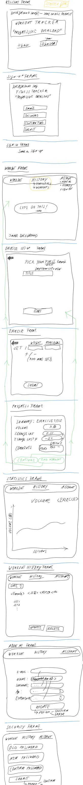

# Project: ProLoad

## Executive Summary
- Free-weights work-out tracker
- Allowing the user to record, save, and evaluate their weight training performance statically and serially
- CRUDing on 4 resources: user, workout, exercise, and set
- Custom-built back-end with 13 RESTful API routes
- NoSQL Database setup includes sub-documents and 1-to-many resource relationships

### Technologies Used on the Front- and Back-End
Technology | Front-End | Back-End
--- | :---: | :---:
bcrypt | |x 
Bootstrap | x
Chart.js | x
Cors | | x
Express | | x
HTML5 | x
JavaScript | x | x
jQuery | x
Lodash | x | x
Moment | x
MongoDB | | x
Mongoose | | x
NodeJS | | x
Passport | | x
SCSS | x
Spin | x

## Background
I want to build a workout app that reduces the interaction with the interface during the workout session to an absolute minimum. Eventually, the interaction will be limited to the mobile device/fitness band/watch asking the wearer to confirm the weight used. All the other key data points, such as repetitions, exercise, duration, heart rate are collected and stored automatically. The key USP will be the AI-driven recognition of the exercise type and the repetitions. I believe this can be achieved with 4 spatially aware sensors, each attached to the extremities of the wearer.

Whilst this is setting the scene and future development potential, this version of the app will not include the core functionality but rather resemble a bare-bones fitness tracker with mobile-first UX / UI, sign-up and sign-in functionality, and basic CRUD operations, including exercise tracking, storing, and update/review functionality.

Every fitness tracker I ever used failed to live up to the expectations because:
1. They have proved to be intrusive during the work-out - requiring cumbersome data entry or offer up a plethora of useless information that bears limited to no actionable value (e.g. staying within a certain heart rate band for cardio-vascular training)
1. Currently, available apps collect some data, but none actually offer much actionable
   advice on the back of that data

## Technologies Used
This repo is the front-end of the project. It was written using:
+ JavaScript
+ HTML
+ CSS/SCSS

The frameworks and libraries used, include:
+ jQuery
+ Bootstrap
+ Chart.js
+ Lodash
+ Spin
+ Moment

## Links to Repos and Hosted Applications
### Front-end
The [front-end app](https://sven-gerlach.github.io/workout-tracker-client/) is hosted on GitHub Pages whilst the [front-end repository](https://github.com/sven-gerlach/workout-tracker-client) lives on GitHub.

### Back-end
The [back-end API](https://glacial-lowlands-84293.herokuapp.com/) is hosted on Heroku whilst the [back-end repository](https://github.com/sven-gerlach/workout-tracker) can be found on GitHub.

## Wireframes

## User Stories
+ As an athlete I want to sign-up fast and be able to use the app immediately on my existing training plans.
+ As an athlete I want to use the app predominantly on my phone with minimum distractions during my training.
+ As an athlete I want the app to store individual exercises, the sets, reps, weights, duration of the exercise, duration of breaks between reps and sets.
+ As an athlete I want to review recent training summaries and be able to comment on potential changes/amendments to my training regime for the next time I do this exercise.
+ As a personal instructor I want to review my client's training diary and comment on them and make changes to the
  upcoming training plan.

## Planning Documentation

### Planning
1.  [x] Review of the requirements / brief
1.  [x] Create User Stories
1.  [x] Create Wire Frames
1.  [x] Create ERD

### Client
1.  [x] Sign Up (curl then web app)
1.  [x] Sign In (curl then web app)
1.  [x] Change Password (curl then web app)
1.  [x] Sign Out (curl then web page)
1.  [x] All API calls have success or failure messages
1.  [x] Create resource (curl then web app)
1.  [x] Get all of their owned resources (curl then web app)
1.  [x] Delete single resource (curl then web app)
1.  [x] Update single resource (curl then web app)

### Final Touches
1.  [x] README
1.  [x] Troubleshoot/Debug
1.  [x] Refactor

## Stretch Goals / Next Development Phase
1. Build in timer functionality that allows the user to record time, including total time under load, total breaks between reps and, separately, time between sets, as well as average break lengths
1. Exercise Templates
1. Review historic workout in more detail than currently possible in the graph function (which only shows total volume per exercises)
1. Combine with third-party trackers with the end-goal being that the only data point the user has to enter on their phone / smart-watch is the weights used (reps, sets, and exercises are all tracked automatically)
